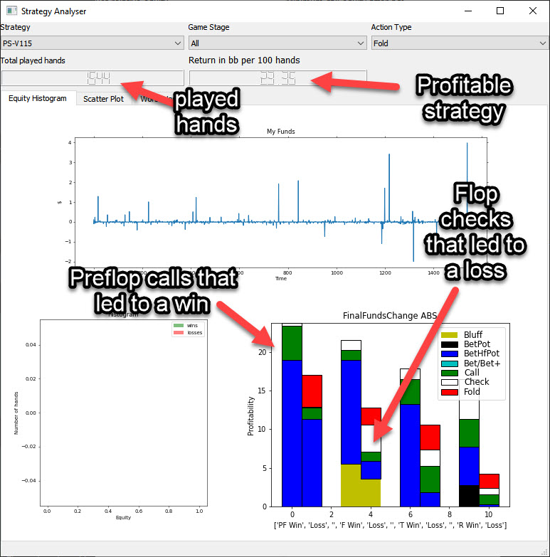
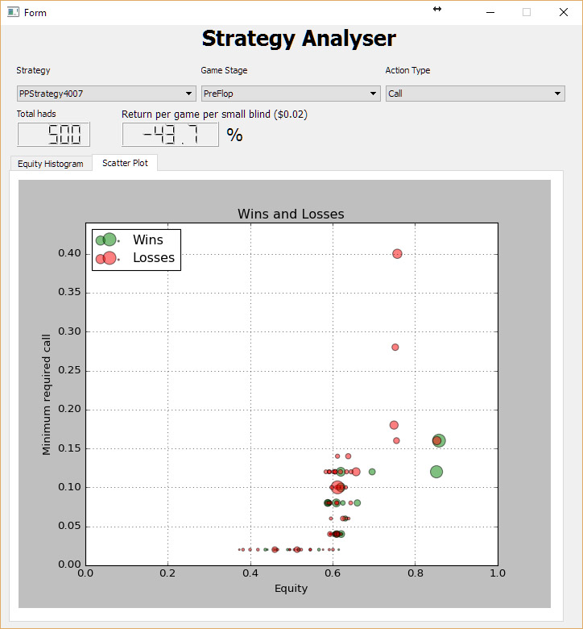

Deep mind pokerbot for pokerstars and partypoker
================================================

This pokerbot plays automatically on Pokerstars and Partypoker.
It works with image recognition, montecarlo simulation and a basic genetic algorithm.
The mouse is moved automatically and the bot can potentially play for hours based on a large number of parameters.
A new gui to help it recognize new tables ia available as well.

You can download the binaries and run the executable directly from here:
https://sourceforge.net/projects/partypoker-pokerstars-pokerbot/

.. figure:: doc/fullscreen1.png

Related projects:
Training the bot by playing against itself is a separate project which can be found here:
https://github.com/dickreuter/neuron_poker

Running the bot:
----------------

General setup:
~~~~~~~~~~~~~~

If you just want to run the bot, please download the binaries from here: https://sourceforge.net/projects/partypoker-pokerstars-pokerbot/

For a start please make sure of the following:

Use Partypoker standard setup. Currently, the bot only works on tables with 6 people and where the bot is always sat at the bottom right.
Put the partypoker client (inside the VM) and the bot outside the VM. Put them next to each other so that the bot can see the full table of Partypoker.
In setup choose Direct Mouse Control. It will then take direct screenshots and move the mouse. If that works, you can try with direct VM control.
Start with a table like Fast Forward Holdem $1-$2 on Partypoker where the stakes are low ( In the strategy editor create a copy of a strategy and edit it yourself so that you win.
The bot may not work with play money as it's optimized on small stakes to read the numbers correctly.
The current version is compatible with Windows. Make sure that you don't use any dpi scaling, Otherwise the tables won't be recognized.

It may be useful to run the poker client inside virtual box https://www.virtualbox.org/wiki/Downloads as it can be controlled easier that way.
Run the bot outside of this virtual machine. As it works with image recognition make sure to not obstruct the view to the Poker software.
Only one table window should be visible.

Running via python code
~~~~~~~~~~~~~~~~~~~~~~~
- Download pycharm as an IDE
- Install python 3.8 or Anaconda (=python with packages)
- Create an environment with ``conda create -n poker python=3.8`` or use pycharm's functionality to create a new virtual environment. Chefck youtube for details.
- Install all the packages with ``pip install -r requirements.txt``
- You also may need to get c++ runtime distributable: https://visualstudio.microsoft.com/downloads/
- Install tesseract from https://github.com/UB-Mannheim/tesseract/wiki which is needed for OCR of the numbers that are scraped
- Install virtualbox from https://www.virtualbox.org/wiki/Downloads and put the poker client into the virtual box. That way it can be controlled without having to use the mouse in your main window.
- Run ``main.py`` from pycharm after setting up the above created virtual environment as interpreter (check youtube)

Strategies
----------
The decision is made by the Decision class in decisionmaker.py. A variety of factors are taken into consideration:

- Equity (winning probability), which is calculated by Montecarlo_v3.py (will be replaced with a faster numpy-only version in Montecarlo_v4.py)
- Equity and minimum call/bet value need to be on the left of the corresponding curve in order for the bot not to fold
- Various other factors, such as behaviour in the previous rounds are taken into consideration. Check out the strategy editor ffor more details.

.. figure:: doc/strategy2.png

Packages and modules:
~~~~~~~~~~~~~~~~~~~~~

main.py: entry point

poker.scraper
^^^^^^^^^^^^^

Contains user interface and routines that help map new tables

- ``recognize_table``: Functions to recognize the different items on the table, based on the created mapping
- ``screen_operations``: Various routines, such as taking screen shots, cropping etc
- ``table_setup``: Routines in relation to the gui
- ``ui_table_setup``: QT user interface. Corresponding py file is created with makegui.bat in the parent folder. To edit the gui download QT Designer and open the .ui file.

poker.decisionmaker
^^^^^^^^^^^^^^^^^^^

-  ``decisionmaker.py``: The ultimate decision what action should be taken based on the input
-  ``montecarlo_numpy2.py``: fast numpy based montecarlo simulation to
   calculate equity. Not yet working correctly. Some tests are failing. Feel free to fix them.
-  ``montecarlo_python.py``: relatively slow python based montecarlo for equity calculation. Supports
   preflight ranges for other players.

poker.tests
^^^^^^^^^^^

-  ``test_montecarlo_numpy.py``: tests for the numpy montecarlo
-  ``test_pylint.py``: pylint and pydoc tests to ensure pep8 standards and static code analysis

Roadmap
-------
- [x] Build a framework that can play online
- [x] Createa a tool that helps to map the tables and make maps shared over all users via mongodb
- [x] Update the pokerbot to the new table format of partypoker
- [ ] Update the pokerbot to the new table format of pokerstars
- [ ] Fix pylint errors and imporve code quality
- [ ] Update tests. Some are currently outdated. More tests are needed
- [ ] Make travis to work. Windows support is currently limited, so most likely the bot needs to be made linux compatible (and also mac)
- [ ] Add more strategies
- [ ] The bot is using tesseract to recognize the numbers of how high the calls and bets are and how big the pot sizes are. Currently all images need to be rescaled and filtered before they are fed to tesseract.
After that regular expressions are used to further filter the results. This is not a satisfactory method and can lead to errors. Ideally tesseract or any other OCR libary could be trained to recognize the numbers correctly.
- [ ] Combine the bot with the neuron_poker project and have it play based on learned strategies via self-play based on reinforcement learning

How to contribute
-----------------

- The easiest way to contribute is by either:
    - adding new tables.
    - Adding new strategies
    - Directly add fixes to the code and create a pull request

Adding new tables
~~~~~~~~~~~~~~~~~

`Click here to see a Video description how to add a new table <https://www.dropbox.com/s/txpbtsi1drncq4x/20200531_194837.mp4?dl=0>`_

The setup to add new tables looks like this:

.. figure:: doc/scraper.png

- Open the pokerbot and click on table setup to open the window that helps you create new tables.
- Open the poker client next to it, make sure it's not dpi scaled, so the pokerbot can take screenshots.
- Start with creating a new template, you can do this by entering a name for your template, for example Pokerstars 1-2 zoom poker. Click on 'Blank new'.
- Now the first think you want to do is to take a screenshot of the pokerstars window with the table. You can do this by pressing on the Take screenshot button. You should not see in the lower window a full screenshot of what is on your screen.
- The first step is now to mark the top left corner of the poker tables window, which will be the point of reference for everything else that will follow. To mark the top left corner, you need to mark it by first clicking on the top left part of it and then on the right lower part of it. once you have done this, it will appear in the second window. You can save it by clicking on the "save newly selected top left corner" button.
- Now you can crop it by pressing on the crop from top left corner button. This will discard most of the screenshot and only keep the screenshot from the top left corner and everything a few hundred pixels to the right of it and below.
- Next you will want to mark everything else in the window. Start with the Buttons search area. You can do this again by clicking on the top left area of the buttons and then on the bottom right area of where the buttons appear. Once you are happy with the selection, click on the "Buttons search area".
- If you hover over the buttons, you will get a more detailed description of what you need to pay attention to.
- Note that you will need to take many screenshots, crop them (don't select the top left corner again, as this you should only do once), instead load it and then crop the image. After that make your selection of the different images and save them by pressing on the corresponding button. You'll need to teach it every card and every button etc.

Making fixes in the code
~~~~~~~~~~~~~~~~~~~~~~~~

- Fixing code and making a pull request back into the origin/master:

It will be hard for one person alone to beat the world at poker. That's
why this repo aims to have a collaborative environment, where models can
be added and evaluated.

To contribute do the following:

- Get Pycharm and build the virtual python environment. Use can do: ``pip install -r requirements.txt`` (see above)
- Clone your fork to your local machine. You can do this directly from pycharm: VCS --> check out from version control --> git
- Add as remote the original repository where you created the fork from and call it upstream (the connection to your fork should be called origin). This can be done with vcs --> git --> remotes
- Create a new branch: click on master at the bottom right, and then click on 'new branch'
- Make your edits.
- Ensure all tests pass. Under file --> settings --> python integrated tools switch to pytest. You can then just right click on the tests folder and run all tests. All tests need to pass. Make sure to add your own tests by simply naming the funtion test\_... \
- Make sure all the tests are passing. Best run pytest as described above (in pycharm just right click on the tests folder and run it). If a test fails, you can debug the test, by right clicking on it and put breakpoints, or even open a console at the breakpoint: https://stackoverflow.com/questions/19329601/interactive-shell-debugging-with-pycharm
- Commit your changes (CTRL+K}
- Push your changes to your origin (your fork) (CTRL+SHIFT+K)
- To bring your branch up to date with upstream master, if it has moved on: rebase onto upstream master: click on your branch name at the bottom right of pycharm, then click on upstream/master, then rebase onto. You may need to resolve soe conflicts. Once this is done, make sure to always force-push (ctrl+shift+k), (not just push). This can be done by selecting the dropdown next to push and choose force-push (important: don't push and merge a rebased branch with your remote)
- Create a pull request on your github.com to merge your branch with the upstream master.
- When your pull request is approved, it will be merged into the upstream/master.
- Please make sure that all tests are passing, including the pylint test. You can either run them locally on your machine, or when you push check the travis log on github. [currently many are failing, feel free to help fixing them!]

FAQ
---

Why is the bot not working?
~~~~~~~~~~~~~~~~~~~~~~~~~~~
- It only works on windows currently
- It only works with fast forward games with real money on PartyPoker. Use the Supersonic3 table for Partypoker or McNaught table in Pokerstars
- The poker table window has to be fully visible and cannot be scaled, otherwise it won't be detected properly
- In Partypoker, when you open the table, choose table options and then choose **back to default size** to make sure the table is in default size.

Errors related to the virtual machine
~~~~~~~~~~~~~~~~~~~~~~~~~~~~~~~~~~~~~

- Go to setup and choose direct mouse control.

Do I need to use a virtual machine?
~~~~~~~~~~~~~~~~~~~~~~~~~~~~~~~~~~~

- For Pokerstars you definitely do, otherwise you will be blocked and your account will be frozen within minutes. For Partypoker I'm not sure. But best check the terms and conditions.

The bot does not recognize the table and doesn't act
~~~~~~~~~~~~~~~~~~~~~~~~~~~~~~~~~~~~~~~~~~~~~~~~~~~~

- Make sure everything looks exactly like in the picture above. The buttons need to look exactly like this and it needs to be in English and not scaled. Colours need to be standard.
- If things still don't work, consider teaching it a new table

Still having problems?
~~~~~~~~~~~~~~~~~~~~~~

- Check the log file. In the folder where you installed the pokerbot, there is a subfolder with the log files in /log. There are also screenshots in /log/screenshots that may be able to help debug the problem.
- Create a issue on the link at the top of this github page https://github.com/dickreuter/Poker/issues or email dickreuter@gmail.com