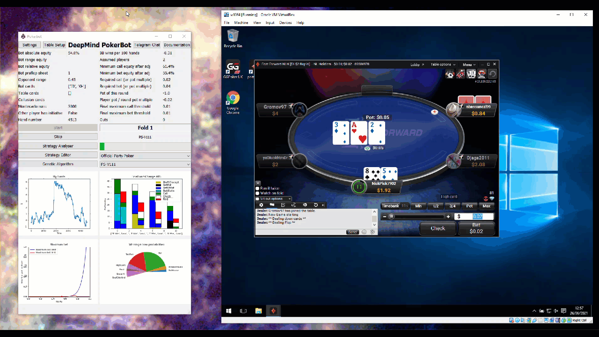
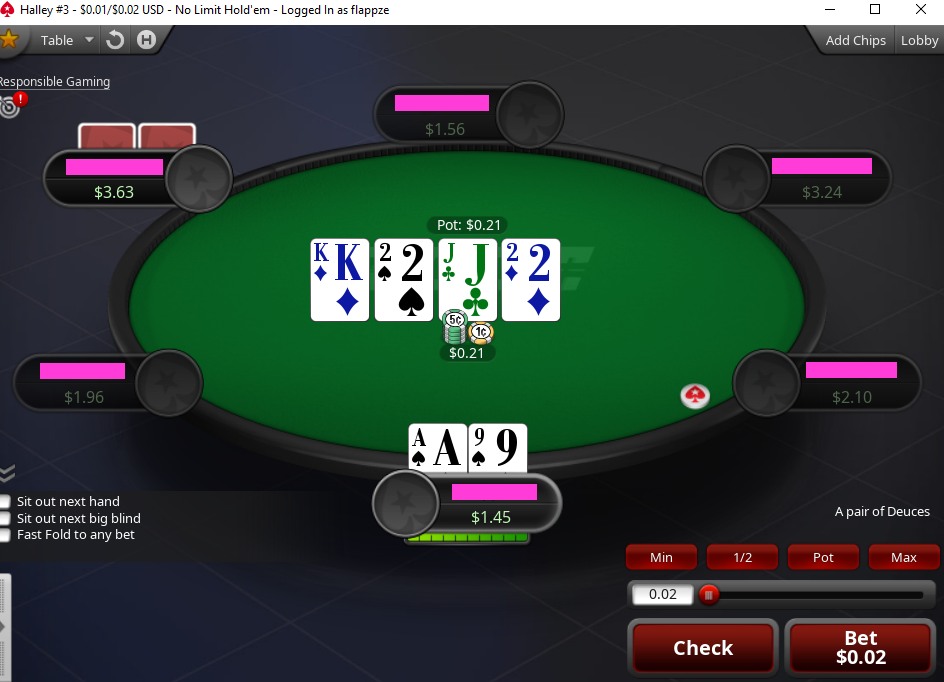
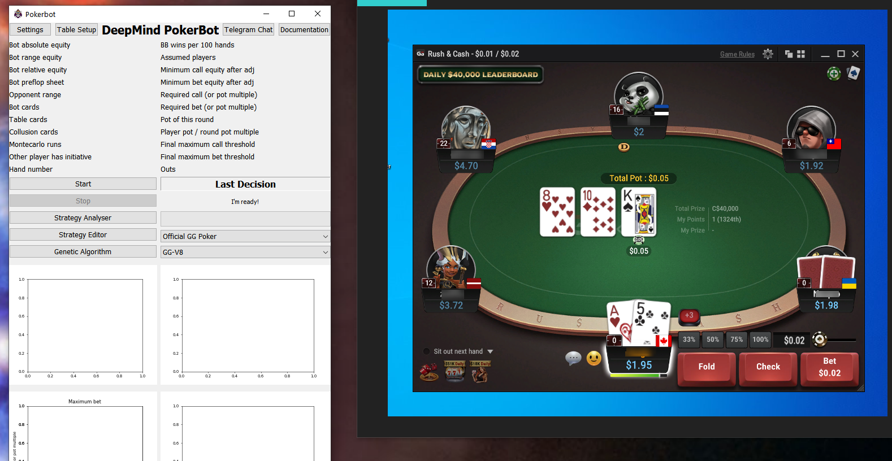
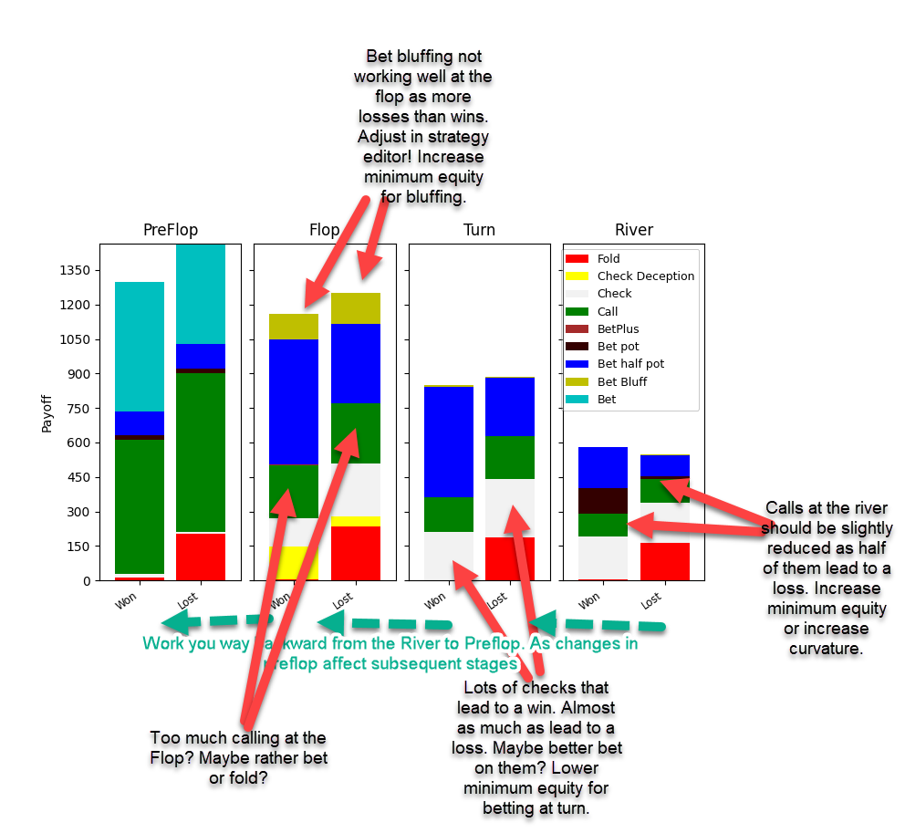
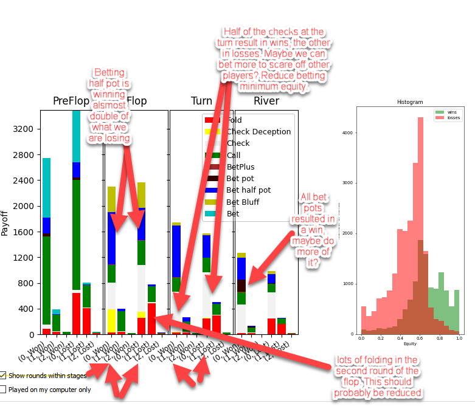
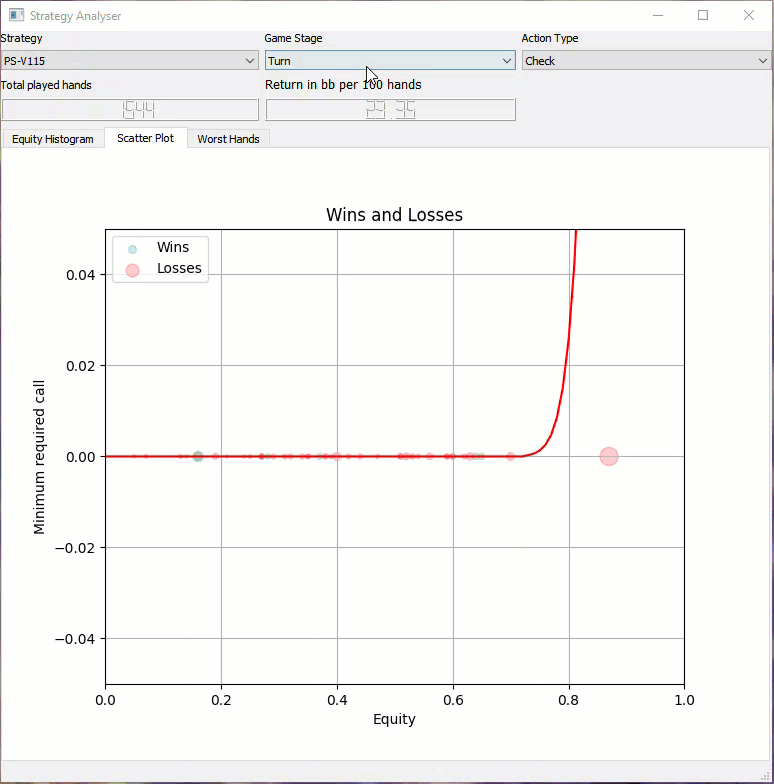
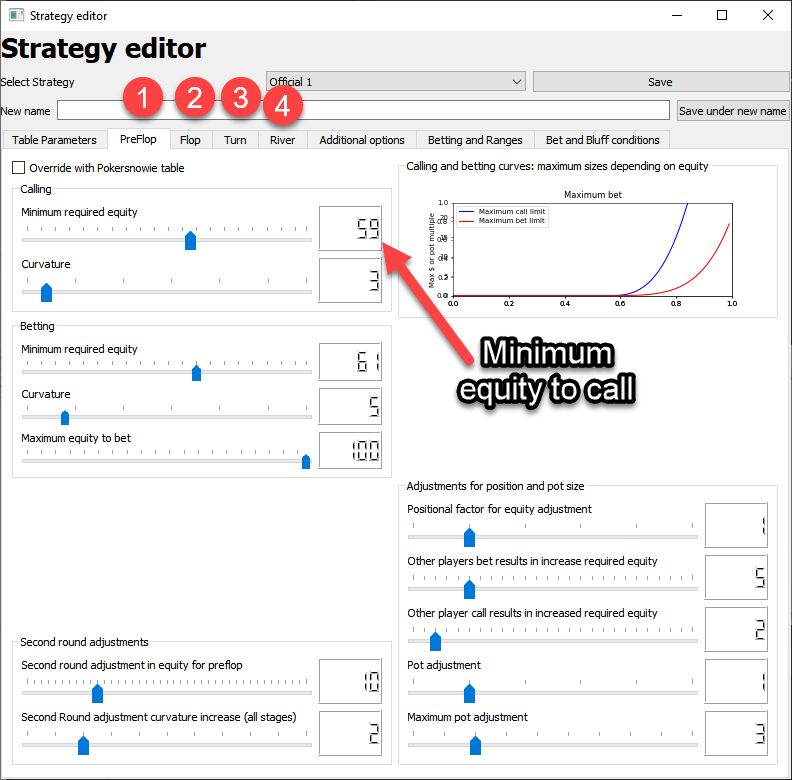
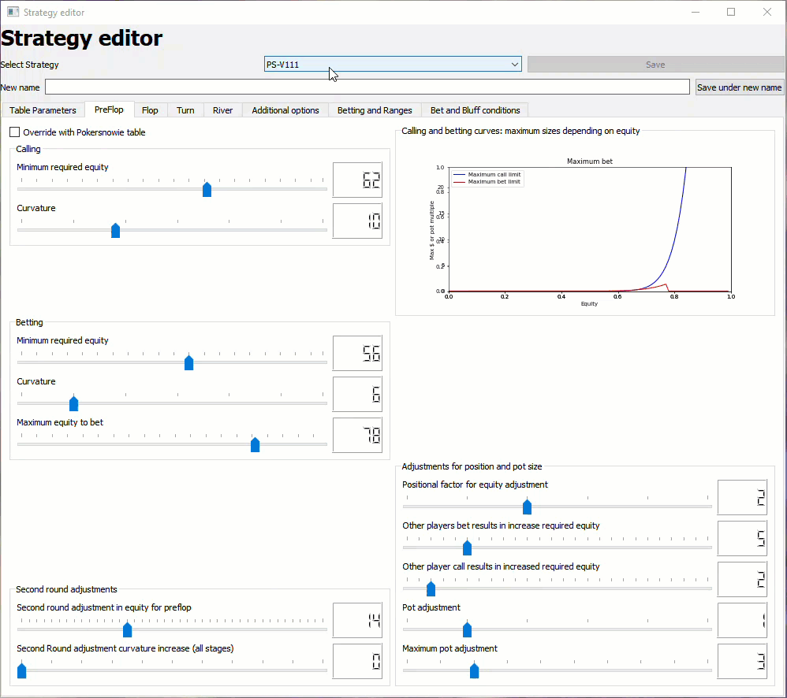
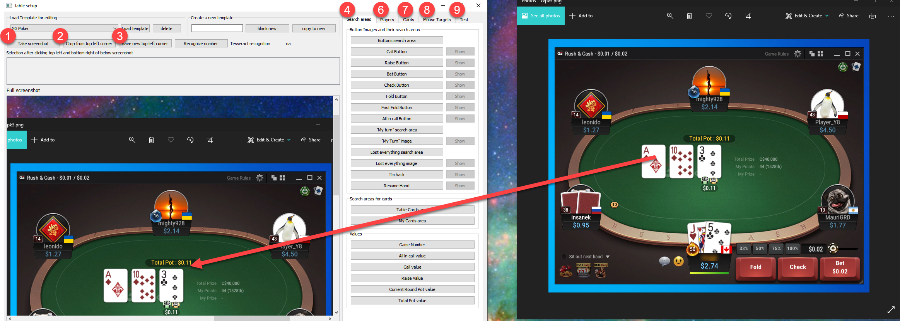

DeeperMind pokerbot for pokerstars, partypoker and GGPoker
==========================================================

This pokerbot plays automatically on Pokerstars, Partypoker and GG Poker. Any other table can be mapped as well.
It works with image recognition, montecarlo simulation and a basic genetic algorithm.
The mouse is moved automatically and the bot can potentially play for hours based on a large number of parameters.

You can download the binaries and run the executable directly from here:
http://www.deepermind-pokerbot.com

Running the bot:
----------------

Partypoker:
~~~~~~~~~~~
* Use Fast Forward Tables
* Select Official PartyPoker table scraper

Pokerstars:
~~~~~~~~~~~
* Use Zoom Tables
* Select Official Poker Stars table scraper
* For Pokerstars you will need to make some adjustments to the client. It needs to look exactly as the below, in order to run it with the Official Pokerstars Table scraper:
* Make sure to match the card styles (4 color), covered card styles, and table styles.

GGPoker:
~~~~~~~~~~~
Make sure your GGPoker setup looks as follows when using it with the Official GGPoker Table:

General setup:
~~~~~~~~~~~~~~

If you just want to run the bot, please do the following:

Install the binearies of the bot from here: http://www.deepermind-pokerbot.com

You can then immediately run the bot. It will analyze the poker client, move the mouse and play in accordance
with one of its pre-programmed strategies. Most of the strategies are based on zoom or Fast Forward tables.
You are welcome to edit and imporve any strategies to optmize the play of the bot for your needs.

In most cases it may be useful to put the poker client inside a virtual machine to avoid it from interfering
with the bot. Also, the bot will then be able to control the mouse inside the virtual machine, without blocking
the whole computer:

* Download Virtualbox: https://www.virtualbox.org/
* Download Windows 10 Iso File for example from here https://www.softlay.com/apps/operating-system
* Create a new virtual box environment and use the ISO file as a startup
* Make sure to give the Virtualbox only 1 CPU as the computing power is needed for the bot (mainly for OCR)
* Install Partypoker or Pokerstars in the virtual box environment
* Install the pokerbot directly onto your computer (outside of the virtual box)
* In the Setup select your virtual box instance (instead of direct mouse control)
* Join the discord chat by pressing the chat button or joining this link: https://discord.gg/xB9sR3Q7r3

* The current version Only works on windows
* Do not obstruct the view of the table as the bot is based on image recognition
* Only one table window should be visible.
* For best performance minimize all windows in the vm, except the table window itself
* Don't use any dpi scaling in the virtualbox
* In setup, try to select your virtual machine instead of direct mouse control. That way mouse movements won't obstruct you.

Strategy Analyzer
-----------------

- You can see the profitability of each strategy in the strategy analyzer.
- The bar chart indicates what action types have led to wins or losses at each stage (preflop, flop turn and river)

Looking at the stacked bar chart in more detail, gives you clues how to adjust the strategy to maximize your wins:

Analyze individual rounds within each stage:

Analyze individual hands:

Strategy editor
---------------
A variety of factors are taken into consideration when the bot makes decisions and they can be adjusted in the strategy editor:

- Equity (winning probability), which is calculated by a montecarlo simulation
- Equity and minimum call/bet value need to be on the left of the corresponding curve in order for the bot not to fold
- Various other factors, such as behaviour in the previous rounds are taken into consideration. Check out the strategy editor for more details.
- Hover over each item to see a more detailed description

A variety of other options can be edited for each strategy:

Advice how to improve strategies:
~~~~~~~~~~~~~~~~~~~~~~~~~~~~~~~~~

* You will generally require at least 2000 hands played with a strategy to draw any conclusions. Even better 5000 hands. Anything less than 1000 hands is completely random.
* Best buy in more than the minimum, this will improve the bots performance as it has more leeway to play. For example on a 0.01/0.02 table, buy in more than the minimum of $2. Ideally start with $4 or even more.
* Look at the strategy analyzer and work your way backwards. First improve the River play, then once this is good move on to the Turn, then to the Flop etc. This is because the game is path dependent.
* If you make changes in the ranges, you may need to adapt all minimum equities as it changes the equity calculation.
* Good Luck!

Full version:
~~~~~~~~~~~~~

The full version allows you to:

* Edit and create new Strategies
* View all Strategies of all users

To purchase, please follow this link. You'll then receive a password within 24 hours.
http://www.deepermind-pokerbot.com/purchase

Alternatively you can contact me via email or discord and request a password directly and pay bitcoin to:
1Py5o4WLYMizXc8pFPqzD4yeCAm53BhJit

You can also get a free subscription if you make some meaningful contribution to the codebase.

The easiest way to contribute is by:

- Adding new tables
- Adding new strategies
- Directly add fixes to the code and create a pull request

Mapping new tables
------------------

The bot can learn to read new tables, either by using templates or by training a neural network that uses data augmentation based on the given templates.

`Click this link to see a Video description how to add a new table <https://rb.gy/jut3ws>`_ or watch the video on www.deepermind-pokerbot.com

The setup to add new tables looks like this:

- Open the pokerbot and click on table setup to open the window that helps you create new tables.
- Open the poker client next to it, make sure it's not dpi scaled, so the pokerbot can take screenshots.
- Start with creating a new template, you can do this by entering a name for your template, for example Pokerstars 1-2 zoom poker. Click on 'Blank new'.
- Now the first think you want to do is to take a screenshot of the pokerstars window with the table. You can do this by pressing on the Take screenshot button. You should not see in the lower window a full screenshot of what is on your screen.
- The first step is now to mark the top left corner of the poker tables window, which will be the point of reference for everything else that will follow. To mark the top left corner, you need to mark it by first clicking on the top left part of it and then on the right lower part of it. once you have done this, it will appear in the second window. You can save it by clicking on the "save newly selected top left corner" button.
- Now you can crop it by pressing on the crop from top left corner button. This will discard most of the screenshot and only keep the screenshot from the top left corner and everything a few hundred pixels to the right of it and below.
- Next you will want to mark everything else in the window. Start with the Buttons search area. You can do this again by clicking on the top left area of the buttons and then on the bottom right area of where the buttons appear. Once you are happy with the selection, click on the "Buttons search area".
- If you hover over the buttons, you will get a more detailed description of what you need to pay attention to.
- Note that you will need to take many screenshots, crop them (don't select the top left corner again, as this you should only do once), instead load it and then crop the image. After that make your selection of the different images and save them by pressing on the corresponding button. You'll need to teach it every card and every button etc.

Notes to keep in mind:
------------------------------

**IT IS NOT RECOMMENDED TO CONDUCT TESTS WITH REAL ACCOUNTS UNTIL YOU VERIFY THE CORRECT FUNCTIONING OF THE BOT (ALSO TO AVOID LOSS OF ACCOUNTS AND CAPITAL)**

- Minimum system requirements to run the bot:
- Windows 10 x64 or later (It may work in previous versions but its correct operation has not been verified)
- RAM memory 4 GB or more
- hard drive space 1.6 GB (as always the more the better)
- Micro processor with 4 cores and 4 threads or higher
- GPU is not necessary (neural training gives the option to do it on GPU)
- screen resolution 1920*1800 (it can work with less but its correct operation has not been verified)

- consider the consumption of Virtual box if used and add them to the system explained above
- Poker apps usually run on W7 or higher
- VirtualBox version 7.0.12 or higher with its respective expansion pack

Running via docker
------------------------------

- ``$ git clone https://github.com/dickreuter/Poker.git``
- ``$ cd Poker``
- ``$ docker compose up -d``
- ``$ xhost local:root # This permits the root user on the local machine to connect to X windows display``
- ``$ docker-compose exec app python3 main.py # once the container is running you can launch the bot with this command``

Running via python source code
------------------------------
- Download pycharm communite edition as an IDE from here: https://www.jetbrains.com/pycharm/download/#section=windows
- Install anaconda https://www.anaconda.com/products/distribution
- Download tesserocr:  https://github.com/simonflueckiger/tesserocr-windows_build/releases/download/tesserocr-v2.6.0-tesseract-5.3.1/tesserocr-2.6.0-cp311-cp311-win_amd64.whl -Out tesserocr-2.6.0-cp311-cp311-win_amd64.whl and install the whleel file with pip install 
- Create an environment with ``pip install -r requirements.txt`` and separately run pip install tesserocr
- You also may need to get c++ runtime distributable: https://visualstudio.microsoft.com/downloads/
- Install virtualbox from https://www.virtualbox.org/wiki/Downloads and put the poker client into the virtual box. That way it can be controlled without having to use the mouse in your main window.
- Run ``main.py`` from pycharm after setting up the above created virtual environment as interpreter (check youtube)

Packages and modules:
~~~~~~~~~~~~~~~~~~~~~

main.py: entry point

poker.scraper
^^^^^^^^^^^^^

Contains user interface and routines that help map new tables

- ``recognize_table``: Functions to recognize the different items on the table, based on the created mapping
- ``screen_operations``: Various routines, such as taking screen shots, cropping etc
- ``table_setup``: Routines in relation to the gui
- ``ui_table_setup``: QT user interface. Corresponding py file is created with makegui.bat in the parent folder. To edit the gui download QT Designer and open the .ui file.

poker.decisionmaker
^^^^^^^^^^^^^^^^^^^

-  ``decisionmaker.py``: The ultimate decision what action should be taken based on the input
-  ``montecarlo_numpy2.py``: fast numpy based montecarlo simulation to
   calculate equity. Not yet working correctly. Some tests are failing. Feel free to fix them.
-  ``montecarlo_python.py``: relatively slow python based montecarlo for equity calculation. Supports
   preflop ranges for other players.

poker.tests
^^^^^^^^^^^

-  ``test_montecarlo_numpy.py``: tests for the numpy montecarlo
-  ``test_pylint.py``: pylint and pydoc tests to ensure pep8 standards and static code analysis

Graphical user interface (gui)
^^^^^^^^^^^^^^^^^^^^^^^^^^^^^^

- Download QT for open source project: https://www.qt.io/download-open-source
- Use the qt designer to edit any of the .ui files in gui/ui

Next Priorities
---------------

- [ ] Update tests. Some are currently outdated. More tests are needed
- [ ] Add more strategies
- [ ] Switch from using pytesseract to tesserocr to speed up OCR, this should considerably speed up the bot
- [ ] Better Analyze the collected data to improve strategies

Making fixes in the code
~~~~~~~~~~~~~~~~~~~~~~~~

- Fixing code and making a pull request back into the origin/master:

It will be hard for one person alone to beat the world at poker. That's
why this repo aims to have a collaborative environment, where models can
be added and evaluated.

To contribute do the following:

- Get Pycharm and build the virtual python environment. Use can do: ``pip install -r requirements.txt`` (see above)
- Clone your fork to your local machine. You can do this directly from pycharm: VCS --> check out from version control --> git
- Add as remote the original repository where you created the fork from and call it upstream (the connection to your fork should be called origin). This can be done with vcs --> git --> remotes
- Create a new branch: click on master at the bottom right, and then click on 'new branch'
- Make your edits.
- Ensure all tests pass. Under file --> settings --> python integrated tools switch to pytest. You can then just right click on the tests folder and run all tests. All tests need to pass. Make sure to add your own tests by simply naming the funtion test\_... \
- Make sure all the tests are passing. Best run pytest as described above (in pycharm just right click on the tests folder and run it). If a test fails, you can debug the test, by right clicking on it and put breakpoints, or even open a console at the breakpoint: https://stackoverflow.com/questions/19329601/interactive-shell-debugging-with-pycharm
- Commit your changes (CTRL+K}
- Push your changes to your origin (your fork) (CTRL+SHIFT+K)
- To bring your branch up to date with upstream master, if it has moved on: rebase onto upstream master: click on your branch name at the bottom right of pycharm, then click on upstream/master, then rebase onto. You may need to resolve soe conflicts. Once this is done, make sure to always force-push (ctrl+shift+k), (not just push). This can be done by selecting the dropdown next to push and choose force-push (important: don't push and merge a rebased branch with your remote)
- Create a pull request on your github.com to merge your branch with the upstream master.
- When your pull request is approved, it will be merged into the upstream/master.
- Please make sure that all tests are passing, including the pylint test. You can either run them locally on your machine, or when you push check the travis log on github. [currently many are failing, feel free to help fixing them!]

FAQ
---

No top left corner
~~~~~~~~~~~~~~~~~~

- Make sure everything looks exactly like in the picture at the top of this documentation.
    * The buttons need to look exactly like this and it needs to be in English and not scaled. Colours need to be standard.
    * Most tables are mapped to real money. They won't work with play money.
    * The poker table window has to be fully visible and cannot be scaled, otherwise it won't be detected properly.
    * In Partypoker, when you open the table, choose table options and then choose **back to default size** to make sure the table is in default size.

- Tables are mapped for fast forward and zoom games with real money. Use the Supersonic3 table for Partypoker or McNaught table in Pokerstars.
- If things still don't work, consider teaching it a new table as described above.

Cards not recognized
~~~~~~~~~~~~~~~~~~~~~

- Make sure everything looks exactly like in the picture at the top of this documentation.
    * Make sure to use real money. Tables are different for play money.
    * Ensure you are seated at the position as shown in the picture above.
    * Currently the bot only works for tables with 6 players.

Do I need to use a virtual machine?
~~~~~~~~~~~~~~~~~~~~~~~~~~~~~~~~~~~

- For Pokerstars you definitely do, otherwise you will be blocked and your account will be frozen within minutes. For Partypoker I'm not sure. But best check the terms and conditions.

Analyzing the log and reporting problems
~~~~~~~~~~~~~~~~~~~~~~~~~~~~~~~~~~~~~~~~

- In the folder where you installed the pokerbot, there is a subfolder with the log files in /log. There are also screenshots in /log/screenshots that may be able to help debug the problem.
- Create a issue on the link at the top of this github page https://github.com/dickreuter/Poker/issues or email dickreuter@gmail.com.

Related projects
----------------
Training the bot by playing against itself is a separate project which can be found here:
https://github.com/dickreuter/neuron_poker
